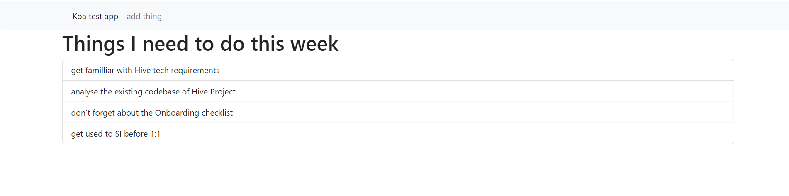
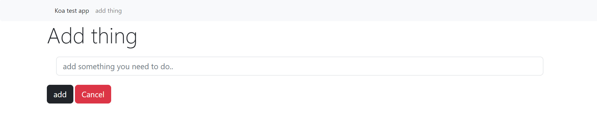

## KoaJS introduction
Modern and minimalist Node.js Framework
 
This project is inspired by traversy media <a link="https://www.youtube.com/watch?v=z84uTk5zmak " >tutorial</a> .
### specifications
* Uses context obj ( contains req & res ) , refer to as ctx usually
* Uses koa-router for routes
* Can be used for simple api (returns json responses) or you can render with koa-ejs

### Test App
the app is static using a table of things and trying different koa modules and functionalities (+ bootstrap)

  
  

